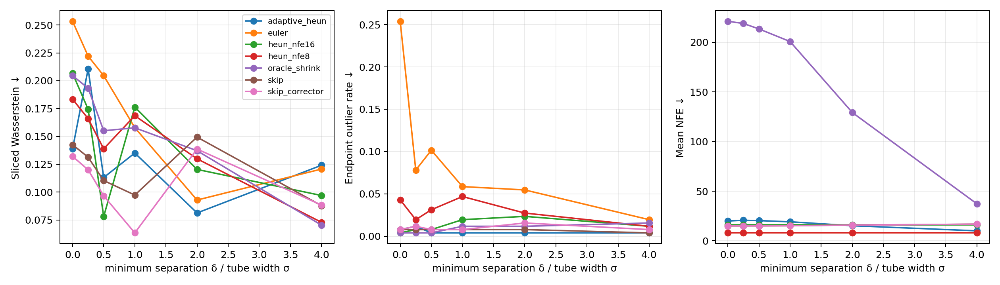
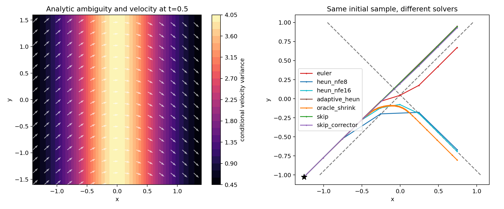

# Reject-and-Skip Flow Solver：二维近交叉流验证报告

日期：2026-08-02  
状态：二维解析 toy 初步验证完成

## 摘要

本实验验证一个针对 flow-matching 局部异常速度场的推理策略：当常规 trial step 进入不可信区域时，不立即接受该步，也不只缩小步长追踪局部速度场，而是回滚到上一个可信状态，尝试用更大的时间步跨过异常区，并在异常区另一侧重新接入速度场。本文将其称为 **reject-and-skip**。

我们构造了一个具有两个近交叉传输分支的二维解析 flow。该模型同时提供精确的边缘速度场、条件速度方差和任意时刻的概率密度，因此能够区分以下三件事：

1. solver 是否得到良好的终点分布；
2. solver 是否准确跟随原始 marginal ODE；
3. solver 是否保留样本原本所属的传输分支。

实验得到明确但需要谨慎解释的结果：reject-and-skip 在约 15–17 次函数求值下，观察到比低步数 Euler 更低的终点异常率，其终点分布指标达到或接近有限样本噪声水平；但是，它与高精度 RK4 参考轨迹之间的误差很大，并且几乎完全保留了原始分支标签。这说明它的作用不是更精确地求解原始 marginal ODE，而是主动绕过由条件速度平均造成的局部坏场，选择一种不同的离散传输 coupling。

因此，这个 toy 为原始机制提供了正向证据，但当前结果还不能证明一个可直接应用于神经网络 backbone 的新 solver。下一阶段的关键是用模型可观测量替代解析 oracle detector，并证明该检测与跳跃策略相对普通 adaptive solver 具有稳定优势。

## 1. 研究问题

Flow matching 训练得到的最优边缘速度可以写成条件速度的后验平均：

\[
v(x,t)=\mathbb{E}[u_t\mid X_t=x].
\]

当多个传输分支在同一个局部区域接近或相交时，后验可能同时包含多个方向明显不同的条件速度。边缘速度场会对这些速度进行平均。即使该场在分布意义上是正确的，它对单条数值轨迹也可能表现为减速、转向、吸向分支中间或者切换分支。

本实验研究的问题不是笼统的“自适应增加步长是否有效”，而是：

> 当一次 trial step 落入条件速度高度不确定的区域时，能否先拒绝该步并回滚，再用更大的步长跨过局部坏场，从而改善有限 NFE 下的终点分布？

对应的反事实基线包括：

- 接受低阶固定步长结果；
- 缩小步长，更准确地追踪 marginal ODE；
- 使用传统局部截断误差控制；
- 拒绝坏 trial，并从异常区之前直接跳到异常区之后。

## 2. 方法

### 2.1 二维解析 crossing flow

我们构造两个带高斯管宽的线性传输分支。对分支标签 \(z\in\{1,2\}\)，样本路径为

\[
X_t=m_z(t)+\sigma\epsilon,
\qquad
m_z(t)=(1-t)a_z+t b_z,
\qquad
\epsilon\sim\mathcal N(0,I).
\]

每个分支的条件速度为常数：

\[
u_z=b_z-a_z.
\]

两个分支在二维平面中形成近似 X 形，并用最小间距 \(\delta\) 控制交叉强度。实验扫描

\[
\delta/\sigma\in\{0,0.25,0.5,1,2,4\}.
\]

其中 \(\delta/\sigma=0\) 是两个分支完全相交的奇异压力测试；更大的比值表示两个概率管在最接近位置更容易区分。

具体地，两个同步中心的相对位移被构造成

\[
m_1(t)-m_2(t)=(-\delta,-2s+4st),
\]

其中 \(s=\tan(\text{angle}/2)\)，本实验取 \(s=1\)。因此

\[
\min_{t\in[0,1]}\lVert m_1(t)-m_2(t)\rVert=\delta
\]

且最小值在 \(t=0.5\) 取得。只有 \(\delta=0\) 时才存在相同 \(t\)、相同位置的真正 crossing；\(\delta>0\) 是 avoided crossing。

因为整个概率路径解析可得，分支后验责任度为

\[
r_z(x,t)=p(z\mid x,t),
\]

精确的 marginal velocity 为

\[
v(x,t)=\sum_z r_z(x,t)u_z.
\]

### 2.2 Oracle 异常度

使用条件速度的后验方差衡量局部速度歧义：

\[
A(x,t)=\sum_z r_z(x,t)\lVert u_z-v(x,t)\rVert^2.
\]

当一个位置只能对应一个分支时，\(A\) 接近零；当两个方向相反或差异较大的分支都具有较高后验概率时，\(A\) 增大。

本实验把

\[
A(x_{\mathrm{trial}},t+h)>0.25 A_{\max}
\]

定义为一次不可信 trial。这里使用了真实解析分支信息，因此它是用于验证策略本身的 **oracle detector**，不是最终可部署的方法。

### 2.3 Reject-and-skip

从当前可信状态 \((x_t,t)\) 出发，基础流程如下：

1. 用当前速度计算普通 trial endpoint：
   \[
   \tilde x_{t+h}=x_t+h v(x_t,t).
   \]
2. 在 trial endpoint 计算异常度 \(A(\tilde x_{t+h},t+h)\)。
3. 如果 trial 可信，则使用梯形/Heun 更新并继续积分。
4. 如果 trial 不可信，则拒绝该步并保留原来的 \((x_t,t)\)。
5. 依次尝试 \(2h,3h,4h\) 的 skip candidate。
6. 接受第一个落回可信区域的 candidate；可选用 candidate 处速度做梯形修正。
7. 如果所有 skip candidate 都不可信，则退化为缩小步长。

这与普通自适应缩步的差别是：缩步试图更忠实地解析异常区内的 marginal ODE；skip 则有意不解析该区域，而是沿异常区进入前的可信方向跨过去。

### 2.4 对比方法

实验包含以下方法：

- `Euler`：8 个固定步，8 NFE；
- `Heun-NFE8`：4 个 Heun 步，8 NFE；
- `Heun-NFE16`：8 个 Heun 步，16 NFE；
- `adaptive Heun`：使用 Euler–Heun embedded error 的传统局部误差控制；
- `oracle shrink`：发现高 ambiguity 后只缩小步长；
- `skip`：拒绝后跨区，不做出口修正；
- `skip + corrector`：跨区后使用梯形修正。

高精度参考解使用 512 步 RK4。

## 3. 实验设置与指标

每个 \(\delta/\sigma\) 条件使用 256 个初始样本，基础步数为 8。主要指标为：

- **NFE**：速度场函数求值次数；
- **Sliced Wasserstein distance（SWD）**：生成终点和真实目标分布之间的距离；
- **Endpoint NLL**：终点在真实目标混合分布下的负对数似然；
- **Endpoint outlier rate**：终点距离最近目标模态超过二维高斯 99% 分位区域的比例；
- **Reference RMSE**：相同初值下，solver 终点与 512 步 RK4 终点之间的误差；
- **Branch retention diagnostic**：终点最近模态是否等于初始人工分支标签。

Branch retention 不是生成质量指标。marginal ODE 只需要匹配边缘分布，没有义务保留 toy 中人为指定的样本分支。这里记录它是为了识别 skip 实际改变了什么。

此外，我们独立重复 100 次“真实目标样本对真实目标样本”的 SWD 计算，估计 256 样本条件下的统计噪声。不同 \(\delta/\sigma\) 下，其均值约为 0.1371–0.1530，标准差约为 0.0714–0.0792。因此，单次 SWD 的小幅领先不应解释为确定优势。

## 4. 结果

### 4.1 代表性数值

| \(\delta/\sigma\) | 方法 | NFE | SWD ↓ | Outlier ↓ | RK4 RMSE ↓ | Branch retention |
|---:|---|---:|---:|---:|---:|---:|
| 0.5 | Euler | 8.0 | 0.205 | 10.2% | 0.644 | 35.5% |
| 0.5 | Heun-NFE8 | 8.0 | 0.139 | 3.1% | 0.123 | 19.5% |
| 0.5 | Heun-NFE16 | 16.0 | 0.078 | 0.8% | 0.160 | 19.9% |
| 0.5 | adaptive Heun | 20.4 | 0.113 | 0.4% | 1.467 | 75.8% |
| 0.5 | oracle shrink | 213.5 | 0.155 | 0.4% | 0.093 | 18.8% |
| 0.5 | skip + corrector | 15.1 | 0.097 | 0.8% | 1.773 | 98.0% |
| 2.0 | Euler | 8.0 | 0.093 | 5.5% | 0.449 | 73.4% |
| 2.0 | Heun-NFE8 | 8.0 | 0.130 | 2.7% | 0.279 | 68.0% |
| 2.0 | Heun-NFE16 | 16.0 | 0.120 | 2.3% | 0.143 | 66.0% |
| 2.0 | adaptive Heun | 15.2 | 0.081 | 0.4% | 0.881 | 86.3% |
| 2.0 | oracle shrink | 129.3 | 0.137 | 1.2% | 0.052 | 64.1% |
| 2.0 | skip + corrector | 15.9 | 0.139 | 1.6% | 1.148 | 97.7% |
| 4.0 | Euler | 8.0 | 0.121 | 2.0% | 0.242 | 94.9% |
| 4.0 | Heun-NFE16 | 16.0 | 0.097 | 1.2% | 0.095 | 92.6% |
| 4.0 | oracle shrink | 37.3 | 0.070 | 1.6% | 0.006 | 91.8% |
| 4.0 | skip + corrector | 16.8 | 0.088 | 0.8% | 0.528 | 99.2% |

完整结果位于外部实验仓库：`/home/lonper/homework/Summer_Intern/runs/toy_crossing_v3/metrics.csv`。

### 4.2 终点分布

相较 8-NFE Euler，skip + corrector 在三个代表性设置中都降低了异常终点比例：

- \(\delta/\sigma=0.5\)：10.2% 降至 0.8%；
- \(\delta/\sigma=2\)：5.5% 降至 1.6%；
- \(\delta/\sigma=4\)：2.0% 降至 0.8%。

它使用约 15–17 NFE，与 16-NFE Heun 属于相近预算。在 \(\delta/\sigma=0.5,2,4\) 时，SWD 分别为 0.097、0.139 和 0.088，均未超过相应 target-vs-target SWD 均值。另一方面，skip 并非每个条件下都取得最低 SWD：例如 \(\delta/\sigma=2\) 时 adaptive Heun 为 0.081，而 skip + corrector 为 0.139。

因此可以说 skip 的终点分布没有表现出明显失真，并且修复了粗 Euler 的一部分 OOD 终点；但由于样本量有限，不能仅凭单次 SWD 宣称它严格优于高精度 Heun 或 adaptive Heun。

### 4.3 ODE 求解精度

`oracle shrink` 在扫描中的 RK4 RMSE 约为 0.006–0.093，明显小于 skip；其代价随分支分离增大而从约 221 NFE 降到 37 NFE。这符合预期：概率管越容易区分，需要解析的高 ambiguity 区域越少。

相反，skip + corrector 的 RK4 RMSE 约为 0.53–1.96，普遍远大于固定步长 Heun。这不是小的离散误差，而是定性不同的轨迹。轨迹图也显示，skip 从异常区前沿原分支方向跨越中心区域，而高精度积分会受到边缘平均速度影响并转到另一条 marginal-flow 轨迹。

因此，reject-and-skip 不能被描述成“以更少 NFE 更准确地近似原 ODE”。更准确的表述是：

> 它通过结构化的离散化偏置，避免在局部高歧义区域追随 marginal velocity，并选择另一种仍能到达目标分布的传输 coupling。

### 4.4 分支行为

在重叠最强的条件下，高精度 Heun 和 oracle shrink 的 branch retention 较低；随着 \(\delta/\sigma\) 增大，它们的 retention 也自然升高。skip + corrector 在整个扫描中约为 98%–99%。这说明两类方法的终点分布可能都合理，但样本级配对不同：

- 高精度方法忠实于解析 marginal ODE；
- skip 方法近似恢复了构造 toy 时使用的 conditional/sample-wise 直线传输。

这正是本 toy 最重要的诊断结果：分布质量提高与 ODE 轨迹误差降低不是同一个目标。

### 4.5 与普通 adaptive Heun 的关系

传统 adaptive Heun 也取得了较好的终点指标和较大的 RK4 RMSE。原因是 embedded error 只比较一个步长两种离散公式的 endpoint；当一步从异常区前跳到异常区后时，它不一定能感知步长内部经过了什么。因此，普通 adaptive solver 也可能偶然实施类似的跨区行为。

这构成当前方案最重要的对照和 novelty 风险。后续方法不能只表述为“异常时增大步长”，而需要证明：

- detector 确实识别了模型不可信区，而不是普通截断误差；
- rollback 和 exit validation 能减少错误跨区；
- 在相同 NFE 下优于传统 adaptive solver 的偶然跳跃；
- 收益能在不同几何结构、模型误差和随机种子下复现。

## 5. 可视化





左图显示 \(t=0.5\) 附近的条件速度方差和边缘速度场；右图使用同一个初始样本比较不同 solver。虚线表示构造 toy 时的两条条件分支。

## 6. 当前结论

本实验支持以下结论：

1. 近交叉、多分支区域能够产生对粗数值轨迹有害的边缘平均速度；
2. reject-and-skip 可以在较低 NFE 下跨过该区域，本次单种子实验观察到异常终点减少；
3. skip 得到的改善不是来自更准确的 ODE 积分，而是来自主动偏离 marginal ODE；
4. 该偏离近似保留了原始 conditional transport 的样本分支；
5. 普通 adaptive solver 也可能发生类似跳跃，因此必须加入更强的机制对照。

当前不能得出的结论包括：

- 不能证明该方法已经适用于训练得到的高维神经速度场；
- 不能证明真实模型中存在可可靠观测的同类异常度；
- 不能从 256 样本的单次 SWD 判断 skip 严格优于 Heun；
- 不能把 oracle ambiguity 当作可部署 detector；
- 不能把完全相交的 \(\delta/\sigma=0\) 奇异情形当作主要实证依据。

## 7. 下一步

建议按照以下顺序推进：

1. **非 oracle detector**：尝试 trial-step disagreement、局部速度夹角、跨尺度预测差异、forward/backward consistency 等只依赖速度网络输出的量。
2. **出口验证**：不仅检查跳跃 endpoint 是否可信，还检查跳跃前后速度方向、密度代理或一致性是否恢复。
3. **增加失败型 toy**：加入平行近邻、真正分叉、弯曲交叉和不应跳跃的窄高曲率区域，测量 false skip。
4. **严格等 NFE 对照**：比较固定 Heun、adaptive Heun、只 shrink、无 rollback 大步长和 reject-and-skip。
5. **多随机种子和更大样本**：报告均值、置信区间和 target-vs-target sampling floor。
6. **迁移到 CIFAR backbone**：冻结同一个 EMA checkpoint和相同初始噪声，先比较轨迹诊断，再计算足量样本的 FID。

## 8. 复现

运行完整 sweep：

```bash
MPLCONFIGDIR=/tmp/flow_solver_mpl \
python -m toys.run_crossing_sweep \
  --output runs/toy_crossing_v3 \
  --samples 256 \
  --base-steps 8 \
  --reference-steps 512
```

运行测试：

```bash
python -m pytest -q
```

本次运行结果为 `14 passed`。

相关实现：

- `/home/lonper/homework/Summer_Intern/toys/crossing_flow.py`：解析概率路径、速度场、概率密度和 ambiguity；
- `/home/lonper/homework/Summer_Intern/toys/adaptive_solvers.py`：固定步长、传统 adaptive、oracle shrink 和 reject-and-skip；
- `/home/lonper/homework/Summer_Intern/toys/run_crossing_sweep.py`：批量实验、指标计算和绘图；
- `/home/lonper/homework/Summer_Intern/tests/test_crossing_toy.py`：toy 与 solver 的基本测试。
