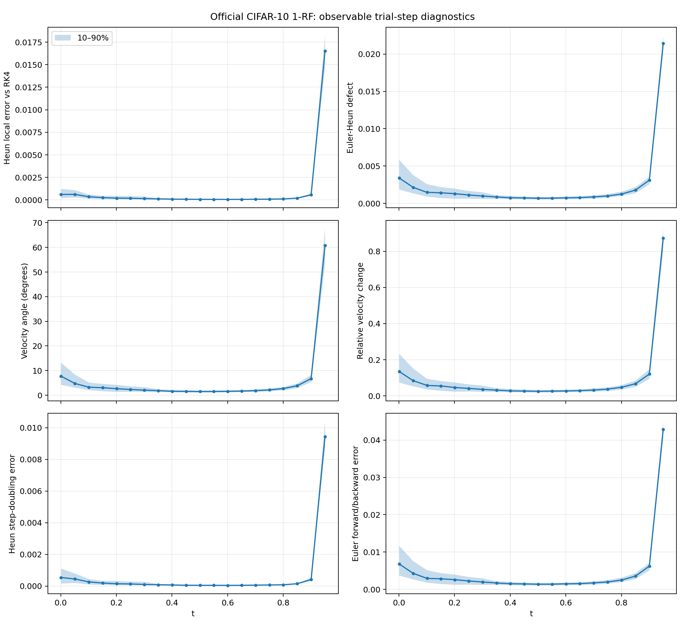
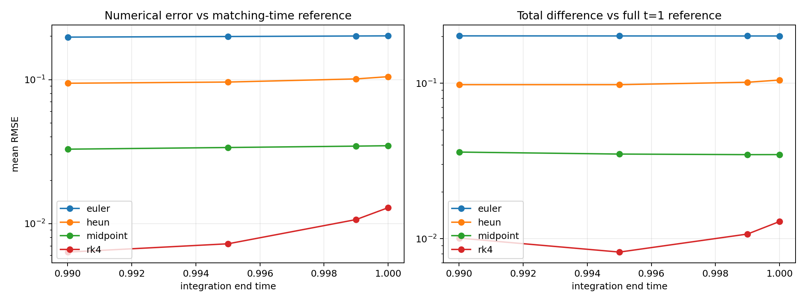
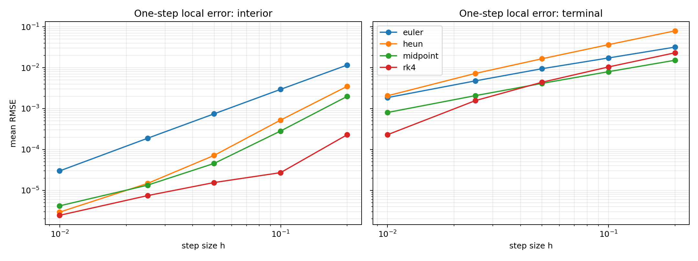

# Official CIFAR-10 1-Rectified-Flow：第一轮 Solver 与轨迹诊断报告

日期：2026-08-03  
状态：第一轮诊断、端点消融与 adaptive Heun 对照已完成；尚未进行 reject-and-skip 或 50k FID 实验

## 摘要

本实验将官方 CIFAR-10 1-Rectified-Flow checkpoint 配置为可复用的 solver backbone，并在 64 个固定初始高斯噪声上比较 Euler、Heun、explicit midpoint 和 RK4。我们还沿高精度参考轨迹记录 Euler–Heun embedded defect、速度夹角、相对速度变化、step-doubling error 和 forward/backward error，检查这些可观测量能否预测真实局部积分误差。

第一轮结果有三个主要结论：

1. 在相同 NFE 下，explicit midpoint 的平均终点误差显著低于 Euler 和 Heun，并在 20 NFE 时优于低步数 RK4。
2. 20 个诊断区间中的最后一段 $t\in[0.95005,1]$ 出现极强误差峰值；该区间占所有“样本—区间”局部 Heun 误差平方和的 99.22%。这表明当前结果主要受到 $t=1$ endpoint pathology 支配。
3. 即使排除最后一个区间，Euler–Heun defect、速度夹角和相对速度变化仍能预测样本级局部误差；step-doubling 几乎复现局部误差排序。但这些信号检测的是相对 ODE reference 的截断误差，不等同于 toy 中的 conditional ambiguity。

因此，本报告的数值实验只能说明各离散方法是否接近 marginal ODE 细步解，以及传统 adaptive controller 的成本；它不能单独判断主动改变 coupling 的 reject-and-skip 是否改善生成分布。下一阶段必须加入同 NFE 的 FID、precision/recall、OOD 等分布指标，并重新设计与 conditional ambiguity 对齐的 detector。

### 方法学修正

本报告早期版本曾用“大步 skip 是否接近 RK4-1000 / 两个小 Heun 步”判断 skip 机制是否成立。该判据与原始 toy 机制不一致，现已撤回。

Toy 中的 reject-and-skip 本来就可能故意偏离 marginal ODE 的细步 coupling：它的 reference RMSE 可以很大，同时 endpoint distribution、outlier rate 或 branch retention 更好。因此，大步相对 RK4 误差更大，只能说明它不是更准确的 ODE integrator，不能说明生成机制无效。后文所有 skip feasibility 数值都必须在这个限制下解释。

## 1. 实验目的

本实验回答以下问题：

1. 官方成熟 Rectified Flow 是否可以稳定作为 solver 实验 backbone？
2. 固定 NFE 时，常用显式 solver 的终点数值误差如何？
3. 真实神经速度场上是否存在局部难积分区间？
4. 不使用人工分支标签或 conditional velocity variance 时，哪些可观测信号能够检测局部积分困难？
5. 当前证据是否足以进入 reject-and-skip 实现阶段？

## 2. Backbone 与运行环境

### 2.1 模型

- 来源：官方 `gnobitab/RectifiedFlow` 仓库
- 数据集：CIFAR-10，32×32，无类别条件
- 模型：DDPM++/NCSN++ 风格卷积速度网络
- 参数量：61,804,419
- checkpoint：`checkpoint_8.pth`
- checkpoint step：800001
- 权重：EMA
- checkpoint 大小：944 MiB

服务器位置：

```text
/mnt/ssd1/jzhangog/external/RectifiedFlow/
```

### 2.2 环境

- Python 3.10
- PyTorch 2.11.0+cu128
- GPU：RTX 4090 D，实验使用物理 GPU 1
- 独立环境：

```text
/mnt/ssd1/jzhangog/venvs/rectified-flow-official
```

为避免引入与采样无关的旧 TensorFlow/JAX 依赖，实验使用独立的最小 PyTorch 采样入口。模型架构与 checkpoint 保持不变。

## 3. 实验设置

### 3.1 初始样本

- 样本数：64
- 初始分布：标准高斯 $x_{\epsilon}\sim\mathcal N(0,I)$
- 随机种子：20260803
- 积分区间：$[\epsilon,1]$
- $\epsilon=0.001$

所有 solver 使用完全相同的初始 latent。

### 3.2 Solver

比较以下固定步长方法：

- Euler：每步 1 NFE
- Heun：每步 2 NFE
- Explicit midpoint：每步 2 NFE
- RK4：每步 4 NFE

高精度终点参考解使用 RK4-100，即 400 NFE。

### 3.3 主要终点指标

对每个样本计算 solver 终点与 RK4-100 参考终点的像素空间 RMSE：

$$
e_i=\sqrt{\frac{1}{D}\left\|x_i^{\text{solver}}-x_i^{\text{ref}}\right\|_2^2}.
$$

报告 64 个样本的 mean、median、90% 分位和 maximum。

该指标只表示数值轨迹误差，不等同于 FID、感知质量或目标分布质量。

### 3.4 局部诊断

将 $[0.001,1]$ 均分为 20 个宏区间，每段长度约为 0.04995。每个宏区间都从高精度参考轨迹状态开始，避免累计的低阶 solver 误差污染 detector 诊断。

局部参考终点使用每个宏区间内 RK4-10，即每段 40 NFE。局部目标为单个 Heun 宏步相对该参考终点的 RMSE。

记录以下候选信号：

- velocity RMS；
- 起点速度与 Euler trial 终点速度的夹角；
- 相对速度变化；
- Euler–Heun embedded defect；
- relative embedded defect；
- 一个完整 Heun 步与两个半 Heun 步的 step-doubling error；
- Euler forward/backward error。

## 4. Solver 基线结果

### 4.1 相同 NFE 比较

表中数值为相对 RK4-100 的平均终点 RMSE。

| NFE | Euler | Heun | Midpoint | RK4 |
|---:|---:|---:|---:|---:|
| 10 | 0.20144 | 0.22558 | **0.10381** | — |
| 20 | 0.12238 | 0.10501 | **0.03499** | 0.05327 |
| 40 | 0.07492 | 0.03586 | **0.01228** | 0.01236 |

### 4.2 尾部误差

| Solver | NFE | Mean | P90 | Maximum |
|---|---:|---:|---:|---:|
| Euler-10 | 10 | 0.20144 | 0.30800 | 0.38200 |
| Heun-5 | 10 | 0.22558 | 0.35004 | 0.45156 |
| Midpoint-5 | 10 | **0.10381** | **0.20164** | **0.35548** |
| Euler-20 | 20 | 0.12238 | 0.19993 | 0.35457 |
| Heun-10 | 20 | 0.10501 | 0.19756 | 0.37421 |
| Midpoint-10 | 20 | **0.03499** | **0.05866** | **0.22869** |
| RK4-5 | 20 | 0.05327 | 0.09638 | 0.23262 |
| Euler-40 | 40 | 0.07492 | 0.12873 | 0.33903 |
| Heun-20 | 40 | 0.03586 | 0.06094 | 0.21727 |
| Midpoint-20 | 40 | **0.01228** | 0.01511 | 0.17305 |
| RK4-10 | 40 | 0.01236 | **0.01479** | **0.05315** |

### 4.3 观察

1. Midpoint 在 10 和 20 NFE 下不仅 mean 最低，P90 和 maximum 也最低。
2. 在 40 NFE 下，midpoint 与 RK4 的 mean 几乎相同，但 midpoint maximum 为 0.17305，约为 RK4 的 3.26 倍。这提示 midpoint 存在少数重尾失败样本；仅看 mean 会掩盖该问题。
3. Heun-5 比 Euler-10 更差，与一般平滑 ODE 上对二阶方法的直觉不符。结合后续轨迹诊断，这很可能与 Heun 在末步直接查询 $v(x,1)$ 有关。
4. 当前 runtime 每个配置只计时一次，且没有独立 warm-up/repetition；因此不能用本轮数据严肃比较 wall-clock，只能比较 NFE 和误差。

完整结果见外部 artifact：`/home/lonper/homework/Summer_Intern/runs/official_rectified_flow/solver_diagnostics_seed20260803/solver_baseline.csv`。

## 5. 轨迹诊断结果



### 5.1 时间结构

Heun 局部 reference RMSE 的中位数大致呈 U 形：

- $t\approx0$ 附近约为 $6\times10^{-4}$；
- 中间 $t\approx0.4$–$0.8$ 约为 $6\times10^{-5}$ 到 $1.1\times10^{-4}$；
- $t\in[0.9001,0.95005]$ 回升至 $5.62\times10^{-4}$；
- 最后区间 $t\in[0.95005,1]$ 突增至 0.01652。

最后区间的中位数是此前所有区间合并中位数的约 135.94 倍。在所有 1280 个“样本—区间”局部误差中，最后 64 个点贡献了局部误差平方和的 99.22%。

需要强调：这里的 99.22% 是独立局部误差平方的集中度，不是对全局终点误差的严格误差分解。

### 5.2 为什么怀疑 endpoint pathology

官方训练代码使用：

```python
t = torch.rand(batch_size) * (1.0 - eps) + eps
```

因此训练时间属于 $[0.001,1)$，不会精确取到 $t=1$。但不同 solver 的末步取样位置不同：

- Euler 只查询末段起点；
- midpoint 查询末段中点；
- Heun 查询末段起点和精确终点 $t=1$，且终点速度权重为 $1/2$；
- RK4 也查询 $t=1$，但终点速度权重为 $1/6$。

这提供了一个统一解释：midpoint 的优势可能很大程度来自避免精确查询 $v(x,1)$，而非单纯因为其二阶精度；Heun 对坏终点速度最敏感；RK4 受到的影响较小。

这是由实验现象和算法采样位置共同支持的推断，但尚未通过终点截断消融严格确认。

## 6. Detector 分析

### 6.1 总体相关性

以单个 Heun 宏步相对局部 RK4 参考的 RMSE 为目标：

| 信号 | 全区间 Spearman | 排除最后区间 | 内部 $t<0.9$ |
|---|---:|---:|---:|
| Velocity RMS | -0.3028 | -0.2692 | -0.2639 |
| Velocity angle | 0.9120 | 0.8975 | 0.8830 |
| Relative velocity change | 0.9121 | 0.8977 | 0.8831 |
| Euler–Heun defect | 0.9157 | 0.9018 | 0.8875 |
| Relative defect | 0.9109 | 0.8962 | 0.8815 |
| Step-doubling error | **0.9977** | **0.9974** | **0.9970** |
| Forward/backward error | 0.9157 | 0.9018 | 0.8875 |

排除 endpoint 后相关性仍然存在，说明结果不完全由最后区间支配。

### 6.2 同一时间片内的样本区分能力

为排除所有信号共享 U 形时间趋势造成的伪相关，我们分别在每个时间区间内对 64 个样本计算 Spearman 相关，再汇总 20 个区间：

| 信号 | 逐区间 Spearman 中位数 | 减去区间中位数后的总体相关 |
|---|---:|---:|
| Velocity RMS | -0.036 | 0.058 |
| Velocity angle | 0.797 | 0.640 |
| Relative velocity change | 0.804 | 0.647 |
| Euler–Heun defect | 0.806 | 0.750 |
| Relative defect | 0.803 | 0.642 |
| Step-doubling error | **0.994** | **0.978** |
| Forward/backward error | 0.806 | 0.750 |

因此 trial-step 信号不仅知道“哪个时间段更难”，还能在同一时间段内识别更难的样本。

### 6.3 Top-10% 困难事件识别

只考虑内部 $t<0.9$，将 detector 排名前 10% 与真实局部误差前 10% 比较：

| 信号 | Top-10% overlap |
|---|---:|
| Velocity RMS | 0.9% |
| Velocity angle | 74.8% |
| Relative velocity change | 74.8% |
| Euler–Heun defect | 75.7% |
| Relative defect | 73.9% |
| Step-doubling error | **97.4%** |
| Forward/backward error | 75.7% |

### 6.4 成本与冗余

- Velocity RMS 不能作为异常检测器：它几乎没有样本内判别能力。
- Velocity angle、relative velocity change 和 Euler–Heun defect 都可以由同一个 Heun trial 的两次速度求值得到，因此无需额外 NFE。
- Euler–Heun defect 是这些低成本信号中最强的单一指标，但它本质上正是传统 embedded error controller。
- 当前 forward/backward 定义满足
  $$
  \|x_{\mathrm{back}}-x\|_{\mathrm{RMS}}=2\|x_{\mathrm{Heun}}-x_{\mathrm{Euler}}\|_{\mathrm{RMS}},
  $$
  因此它与 embedded defect 完全冗余，不应作为独立证据。
- Step-doubling 使用一个完整 Heun 步与两个半 Heun 步，当前实现总共需要 5 NFE。它非常准确，但首先构成一个强大的传统自适应 baseline，而不是 reject-and-skip 的新颖检测机制。

### 6.5 与原始机制对齐：Velocity-Return Scan

原始 reject-and-skip detector 不是 step-doubling。它从当前已接受入口 $(x_0,t_0)$ 出发，复用入口速度 $v_0=v(x_0,t_0)$，依次测试更远的候选出口：

$$
x_{\mathrm{trial}}^{(m)}=x_0+mh\,v_0,
\qquad
v_m=v(x_{\mathrm{trial}}^{(m)},t_0+mh),
$$

并记录相对速度返回曲线：

$$
D(m)=
\frac{\|v_m-v_0\|}
{\tfrac12(\|v_m\|+\|v_0\|)+\epsilon},
$$

以及速度夹角：

$$
A(m)=\angle(v_m,v_0).
$$

当 $D(1)$ 或 $A(1)$ 很大时，先拒绝原候选出口，而不是立即缩步；继续增大 $m$，直到速度重新接近入口，或者跨度达到上限。该策略寻找的是“有限宽局部异常之后的可信出口”，而不是最准确地逼近细步 marginal ODE。

Velocity-return scan 与本节数值 detector 的关系如下：

- $D(1)$ 对应 relative velocity change；$A(1)$ 对应 velocity angle。若基础方法本来使用 Heun，初次检测复用 $v_0,v_1$，不增加 NFE。
- 每测试一个新的 $m$ 只增加 1 NFE，因为 $v_0$ 可以复用。
- 若最终跨过多个普通区间，尝试出口的成本可能被省掉的常规 solver steps 抵消；因此总 NFE 不一定增加。
- Step-doubling 回答“这个步是否接近两个半步”，velocity-return scan 回答“更远出口的速度是否在局部异常后重新接近”。两者目标不同。

现有内部 probe 只测试了 $m=2$。除去 defect 的步长因子后，$D(2)/D(1)$ 的中位数为：全部事件 1.82、局部误差 $\geq2$ 倍候选 1.50、$\geq3$ 倍候选 1.41、$\geq5$ 倍候选 1.27。在 $m=2$ 时尚无事件降到 1 以下，但事件越困难，该比例越接近 1。这不足以否定机制，因为原始规则要求继续搜索更远出口。

下一步应扫描：

$$
m\in\{1,2,3,4,6,8\},
$$

寻找 $D(m)$ 或 $A(m)$ 的“先升高、后下降”非单调结构。出口是否真正可信不能只用 embedded defect 判断，还应结合 projected endpoint

$$
\hat x_1=x_t+(1-t)v(x_t,t),
$$

的一致性、MC-dropout velocity variance 或局部扰动敏感度；最终成败必须由相同总 NFE 下的 FID、KID、precision/recall 和 OOD 等生成分布指标判断。

## 7. 参考解可靠性

主参考为 RK4-100。独立的诊断参考由 20 个宏区间、每段 RK4-10 组成，总计相当于 RK4-200。二者终点平均 RMSE 为：

$$
8.39\times 10^{-4}.
$$

该差异显著小于最佳 40-NFE solver 的约 0.0123，说明 RK4-100 足以区分本轮 solver。但它不是数学上的精确解；后续若研究 $10^{-3}$ 量级改进，需要提高参考精度并做收敛检查。

## 8. 对 Reject-and-Skip 假设的影响

### 8.1 当前证据支持什么

- 真实神经速度场存在明显的时间非均匀数值难度。
- 两次 trial evaluation 已能可靠估计局部积分困难。
- 不同样本在相同时间下的难度不同，因而纯全局时间表不是完整解决方案。
- Midpoint 存在少数重尾失败样本，后续可以研究 detector 是否能提前识别这些样本。

### 8.2 当前尚未回答什么

- 尚未观察到内部时间上的稀疏、尖锐异常区；中间轨迹整体较平滑，主要峰值贴在 $t=1$。
- 没有证据表明局部困难来自 crossing、multimodal conditional velocity averaging 或 branch ambiguity。
- 尚未用生成分布指标判断跨越坏区是否优于缩小步长。
- 没有运行完整 reject-and-skip，也没有计算其 FID、precision/recall 或 OOD rate。
- 大步相对 RK4 reference 更差不能否定机制，因为原方法允许主动改变 coupling。

### 8.3 关键风险

如果现在把最后一步标为异常并执行 skip，方法可能只是在用复杂机制避免查询 $v(x,1)$。Explicit midpoint 已经以标准、简单、低成本的方式实现这一点。因此，endpoint 问题不能直接作为 reject-and-skip 的主要有效性证据。

## 9. 下一轮实验

在实现 skip 前，先完成以下端点消融：

1. 比较积分终点 $1$、$1-10^{-3}$、$1-5\times10^{-3}$ 和 $1-10^{-2}$。
2. 只替换最后一步：Euler、midpoint、Heun、截断 Heun。
3. 将诊断宏区间数改为 40 和 80，判断误差峰是否始终贴着 $t=1$，以及峰宽如何缩放。
4. 加入标准 adaptive Heun 和 step-doubling controller，形成必须击败的 baseline。
5. 使用多个随机种子，保存 per-sample solver error，定位 midpoint 的重尾失败样本。
6. 在去除 endpoint 主效应后，只对内部残差尖峰尝试 `trial → detect → reject/rollback → skip → validate/correct`。

只有当内部困难事件满足以下条件时，才进入正式 skip 实验：

- 不是单纯由全局时间位置决定；
- detector 能以低额外 NFE 识别；
- shrink/adaptive baseline 不能同样解决；
- skip 后经过与“状态可信度”对齐的出口验证，而不是只用 ODE truncation error；
- 在相同总 NFE 下改善 FID、precision/recall、OOD 或其他分布/感知质量；reference error 只作为 coupling-change diagnostic，不作为主要成功判据。

## 10. 端点消融补充实验

第一轮完成后，我们使用同一批 64 个 latent 将参考提高到 RK4-1000（4000 NFE），并运行提前终止与单独末步消融。RK4-1000 参考生成耗时约 162 秒。

### 10.1 提前终止

下表报告 solver 输出相对完整 $t=1$ RK4-1000 reference 的 mean RMSE：

| Solver | NFE | 终止于 0.99001 | 终止于 0.995005 | 终止于 0.999001 | 终止于 1.0 |
|---|---:|---:|---:|---:|---:|
| Euler-10 | 10 | 0.20162 | 0.20137 | 0.20128 | **0.20127** |
| Heun-10 | 20 | 0.09788 | **0.09788** | 0.10147 | 0.10483 |
| Midpoint-10 | 20 | 0.03608 | 0.03503 | 0.03474 | **0.03476** |
| RK4-10 | 40 | 0.01009 | **0.00821** | 0.01072 | 0.01290 |
| Heun-20 | 40 | 0.03304 | **0.03169** | 0.03360 | 0.03570 |
| Midpoint-20 | 40 | 0.01502 | 0.01251 | **0.01183** | 0.01199 |
| RK4-20 | 80 | 0.00848 | 0.00501 | **0.00501** | 0.00588 |

提前停止对 Euler 没有净收益，对 midpoint 收益很小；Heun 和 RK4 在约 $t=0.995$ 附近出现数值误差与截断偏差之间的最优折中。以 RK4-10 为例，从完整终点的 0.01290 降到 0.00821，改善约 36%。

但这不是对完整 ODE 的更准确求解，而是主动引入终止偏差。是否改善生成质量必须用图像指标验证，不能只看相对 reference 的误差抵消。



### 10.2 终点单步与内部单步

从 RK4-1000 参考状态出发，分别在轨迹中部和终点执行一个相同步长的 solver step。对于 $h\approx0.01$：

| Solver | 内部局部 RMSE | 终点局部 RMSE | 终点/内部 |
|---|---:|---:|---:|
| Euler | $2.99\times10^{-5}$ | $1.85\times10^{-3}$ | 约 62× |
| Heun | $2.93\times10^{-6}$ | $2.05\times10^{-3}$ | 约 699× |
| Midpoint | $4.18\times10^{-6}$ | $8.01\times10^{-4}$ | 约 192× |
| RK4 | $2.45\times10^{-6}$ | $2.29\times10^{-4}$ | 约 93× |

Midpoint 不查询精确 $t=1$，但终点误差仍比内部高约 192 倍。因此问题不只是 $v(x,1)$ 单点外推，而是靠近数据端的一层快速变化区域。

将 Heun 的末端时间标签从 1 截到 0.999 可将 $h\approx0.01$ 的末步误差从 0.00205 降到 0.00141，改善约 31%；但仍差于 midpoint 的 0.00080 和 RK4 的 0.00023。这确认直接查询 $v(x,1)$ 确实有害，但不能解释全部边界层误差。



完整数据见：

- `/home/lonper/homework/Summer_Intern/runs/official_rectified_flow/endpoint_ablation_seed20260803/endpoint_truncation.csv`
- `/home/lonper/homework/Summer_Intern/runs/official_rectified_flow/endpoint_ablation_seed20260803/terminal_step.csv`

## 11. Adaptive Heun 对照

实现了逐样本异步 adaptive Heun，使用 Euler–Heun embedded defect，报告每个样本承担的平均 NFE。初始步数为 5，absolute tolerance 为 $10^{-4}$。

| rtol | Mean NFE | Mean reject | Mean RMSE | P90 | Maximum |
|---:|---:|---:|---:|---:|---:|
| 0.2 | 8.97 | 1.03 | 0.23631 | 0.33989 | 0.42462 |
| 0.05 | 19.92 | 4.48 | 0.21530 | 0.34127 | 0.44049 |
| 0.01 | 41.25 | 10.00 | 0.07141 | 0.10643 | 0.28499 |
| 0.005 | 55.83 | 12.86 | 0.03526 | 0.06125 | 0.20700 |
| 0.002 | 79.25 | 15.63 | 0.01767 | 0.02146 | 0.19188 |
| 0.001 | 98.39 | 16.08 | 0.00978 | 0.01209 | 0.15735 |
| 0.0005 | 119.75 | 15.69 | 0.00596 | 0.00598 | 0.12145 |
| 0.0002 | 148.91 | 14.34 | 0.00345 | 0.00265 | 0.10399 |

主要结论：

1. Adaptive Heun 在相同平均 NFE 下不优于固定方法。平均约 79 NFE 时 RMSE 为 0.01767，而固定 RK4-20 在 80 NFE 时为 0.00588。
2. Adaptive Heun 需要约 120 平均 NFE 才达到 0.00596，接近固定 RK4 的 80-NFE 结果。
3. 在严格容差下，约 61%–78% 的 rejection 发生在最后 10% 时间区间。controller 正确识别了边界层，但为此消耗大量 rejection 和小步。
4. 即使 mean 降低，adaptive Heun 的 maximum 仍然很重；例如平均 149 NFE 时 maximum 仍为 0.104，高于固定 RK4-20 的约 0.064。
5. 异步逐样本步长还增加了 batch model calls 和实际 wall-clock 成本，因此平均 per-sample NFE 已是对其较有利的成本口径。

这一数值结果说明“缩步会在高截断误差区域消耗大量预算”的现象在真实模型上存在；但 reference RMSE 不是生成质量，因此该结果既不证明也不否定 skip。它只建立了 adaptive Heun 的成本 baseline。

完整结果：

- `adaptive_heun_seed20260803/adaptive_heun.csv`（宽松容差，位于上述外部 artifact 根目录）
- `adaptive_heun_strict_seed20260803/adaptive_heun.csv`（严格容差，位于上述外部 artifact 根目录）

## 12. 内部大步 Skip 可行性探针

为避免将数据端边界层误当作可跨越异常区，我们只研究 $t\leq0.85$ 的内部入口。使用 RK4-1000 参考轨迹，将局部 Heun 误差超过同时间中位数 3 倍的“样本—区间”定义为 oracle candidate，共得到 22 个事件。

从每个入口比较以下两区间传输：

- 两个普通 Heun 小步：4 NFE；
- 一个双倍 Euler 大步：1 NFE；
- 一个双倍 Heun 大步：2 NFE；
- 一个双倍 midpoint 大步：2 NFE；
- 一个双倍 RK4 大步：4 NFE。

| 方法 | NFE | Candidate mean error | Median / sequential Heun | 优于 sequential Heun 的比例 |
|---|---:|---:|---:|---:|
| Sequential Heun | 4 | 0.001407 | 1.00 | — |
| Skip Euler | 1 | 0.009867 | 7.02 | 0% |
| Skip Heun | 2 | 0.004402 | 2.96 | 0% |
| Skip midpoint | 2 | 0.001685 | 1.29 | 27.3% |
| Skip RK4 | 4 | **0.000343** | 0.24 | 100% |

解释：

1. 相对同一 RK4 reference，双倍 Heun 大步对 22 个候选事件全部误差更大，因此它不是更准确的 ODE 近似；这不能推出其生成分布一定更差。
2. 双倍 midpoint 用一半 NFE 接近两个 Heun 小步，但中位误差仍高 29%，只在 27.3% 事件上更好。
3. 对误差超过时间中位数 5 倍的 4 个最难事件，midpoint 大步的中位误差比约为 0.994，4 个中有 2 个更好。这是一个弱的候选信号，但样本数太小，不能据此形成结论。
4. 大步 RK4 在相同 4 NFE 下明显优于两个 Heun 小步，但它对正常事件同样几乎全部更好。因此这主要是 RK4 的阶数/节点优势，不是 candidate-specific skip 机制。
5. 双倍步的 Euler–Heun defect 在 22 个候选中从未低于原小步 defect，中位增加到 2.82 倍。若出口验证的目标是 ODE 数值精度，它们都会被拒绝；但原始机制需要验证“出口状态是否重新可信”，不能简单复用 embedded defect，否则会把所有主动 coupling change 都判为失败。

还有一个相对信号：midpoint 大步相对 sequential Heun 的中位误差比，在普通事件中为 1.75，在 $\geq3$ 倍 candidate 中降到 1.29，在最难 4 个事件中接近 1。这说明 midpoint 大步相对更适合困难事件，但尚未达到普遍优于小步的程度。

完整数据：

- `skip_feasibility_seed20260803/skip_feasibility.csv`（位于上述外部 artifact 根目录）
- `skip_feasibility_seed20260803/skip_feasibility_summary.json`（位于上述外部 artifact 根目录）

## 13. 更新后的结论

官方 CIFAR-10 1-RF 已成功成为一个稳定且快速的 solver 实验 backbone。实验发现了一个非常强的数据端边界层，并解释了 explicit midpoint 在低 NFE 下的异常优势。同时，Euler–Heun defect、速度夹角和 step-doubling error 对样本级局部数值误差具有真实预测能力。

端点消融确认问题既包括精确 $t=1$ 求值，也包括更宽的数据端快速变化层。Adaptive Heun 能检测该区域，却需要明显多于固定 RK4 的 NFE，且数值尾部仍重。内部 probe 还找到了少量样本特异困难事件，并证明大步方法会明显偏离细步 marginal ODE。

但按照 toy 的原始机制，这种偏离本身不是失败：skip 的目标可能正是改变 coupling 并改善 endpoint distribution。当前实验缺少 FID、precision/recall、OOD 和与 conditional ambiguity 对齐的 detector，因而不能判断 reject-and-skip 的生成机制是否成立。现阶段最诚实的结论是：数值积分层的 baseline 与困难区域已经测清，但机制层实验尚未真正开始。

## 复现实验与产物

- 最小采样脚本：`/home/lonper/homework/Summer_Intern/scripts/sample_official_rectified_flow.py`
- 基线与诊断脚本：`/home/lonper/homework/Summer_Intern/scripts/benchmark_official_rectified_flow.py`
- 分析脚本：`/home/lonper/homework/Summer_Intern/scripts/analyze_official_diagnostics.py`
- 端点消融脚本：`/home/lonper/homework/Summer_Intern/scripts/ablate_official_rectified_flow_endpoint.py`
- Adaptive Heun 脚本：`/home/lonper/homework/Summer_Intern/scripts/benchmark_official_adaptive_heun.py`
- 内部大步可行性脚本：`/home/lonper/homework/Summer_Intern/scripts/probe_official_rectified_flow_skip_feasibility.py`
- 内部大步分析脚本：`/home/lonper/homework/Summer_Intern/scripts/analyze_official_skip_feasibility.py`
- 完整基线：`solver_diagnostics_seed20260803/solver_baseline.csv`（外部 artifact）
- 逐样本逐区间诊断：`solver_diagnostics_seed20260803/trajectory_diagnostics.csv`（外部 artifact）
- detector 相关：`solver_diagnostics_seed20260803/signal_correlations.csv`（外部 artifact）
- 扩展分析汇总：`solver_diagnostics_seed20260803/analysis_summary.json`（外部 artifact）
- 诊断图：已精选复制到本报告附件目录；原图仍保留于外部 artifact
- 实验元数据：`solver_diagnostics_seed20260803/metadata.json`（外部 artifact）
